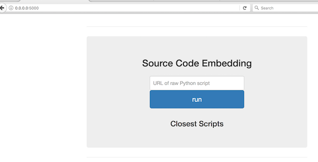
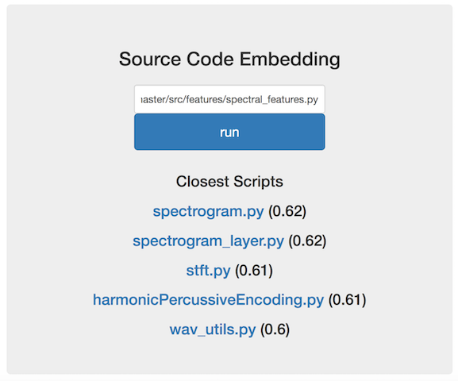
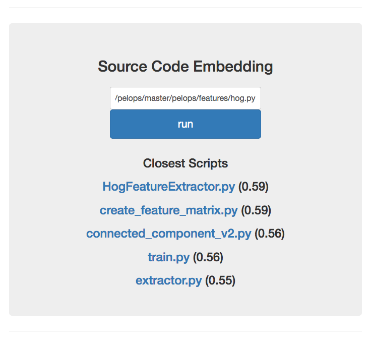

# Altair 


## Read our project findings on our [blog](https://gab41.lab41.org/doc2vec-to-assess-semantic-similarity-in-source-code-667acb3e62d7) then try the demo below

## Assessing Source Code Similarity with Unsupervised Learning

How do you determine what a segment of source code does?

How do you search a corpus for source code that you want to use?

Altair is Lab41's exploration of representing source code and its associated features in a vector space. We are interested in generating robust source code embeddings for Python like [Word2Vec](https://code.google.com/archive/p/word2vec/) creates word embeddings for written text. You can read about our early experimentation with word embeddings for source code on the Lab41 [blog](https://gab41.lab41.org/python2vec-word-embeddings-for-source-code-3d14d030fe8f#.c6zmcq8be).

Our primary use case of source code representation and similarity calculation is enabling meaningful recommendations of code to coders. We believe that similar techniques could be useful for code security analysis, code authorship, and code plaigarism detection.

## Altair Demo via Docker!

1. Download a pickle file containing the Gensim Doc2Vec vectors for 250,000 Python scripts from GitHub [here.](https://drive.google.com/file/d/0B5YNnW8pHPSWandUS2YtaTZVSWc/view?usp=sharing) In this example we saved the downloaded pickle file to ~/models/

2. Build the container 
```
docker build -f Dockerfile.demo -t altair.demo .
```

3. Run the container
```
docker run -v ~/models/:/altair/altair/models/github/ -p 5000:5000 altair.demo
```

4. Open a browser and go to 
```
http://0.0.0.0:5000/
```
You should see the Altair home page below


5. This demonstration expects a url with raw python code. Let's test out Altair on Lab41's Magnolia (speaker separation in audio) project by entering the following url in the white input box:
```
https://raw.githubusercontent.com/Lab41/Magnolia/master/src/features/spectral_features.py
```

Press 'run'. You should see Altair recommendations of audio analysis Python scripts similar to the screenshot below



6. Let's do one more. Let's try Lab41's Pelops (car reidentification via computer vision) project by entering the following url in the white input box:
```
https://raw.githubusercontent.com/Lab41/pelops/master/pelops/features/hog.py
```
Press 'run'. You should see Altair recommendations of computer vision Python scripts similar to the screenshot below




## Make Your Own Altair: Docker container to Vectorize a Folder of Python Scripts (*.py)

The Docker container uses a Doc2Vec model trained on 1 million Python scripts from Github and the output is a dictionary of vectors saved as a pickle file in the "out" volume. A distance measurement (ex: cosine distance) can be used to locate similar vectors in the output. 

Build the container 
```
docker build -f Dockerfile.vectorize_folder -t altair.vectorize_folder .
```

Run the container
```
docker run -v /dirwithPythonScripts/:/in -v /dirtoSaveOutput/:/out altair.vectorize_folder
```

Run the container with custom settings (ex: Use Doc2Vec model trained on 500k Python scripts from Github and specify output file name)
```
docker run -v /dirwithPythonScripts/:/in -v /dirtoSaveOutput/:/out altair.vectorize_folder /altair/models/doc2vec_trainedmodel_cbow_docs500000_negative10_mincount500_minlen2000_win5.pkl /in /out/myoutput.pkl
```

## Prerequisites

Local Computing Components
* git
* python3
* pip
* conda

## Installation

##### Cloning the repository

Clone Altair repository from the command line, then cd into the directory
```
git clone https://github.com/Lab41/altair.git
cd altair
```

##### Conda

Anaconda is a completely free Python distribution. It includes more than 400 of the most popular Python packages for science, math, engineering, and data analysis. Anaconda includes conda, a cross-platform package manager and environment manager and seen by some as the successor to pip.

Before getting started, you’ll need both conda and gcc installed on your system. Download the Anaconda version for Python3+ by entering the following (as of Feb 2017) on a Linux command line:
```
wget https://repo.continuum.io/archive/Anaconda3-4.3.0-Linux-x86_64.sh
bash Anaconda3-4.3.0-Linux-x86_64.sh
```

Once that’s done, you can create an new environment on your system by calling:
```
conda env create -f environment.yml
```

Note: If the conda command is not found, start a new shell to refresh your path.

After it finishes, you should have a new conda environment named altair containing all of the dependencies. Activate it by calling
```
source activate altair
```
Check out the preprocessing [README.md](altair/preprocess00/README.md) to find out where you can obtain our training and testing data.

## Notes

Per [Gensim](http://radimrehurek.com/gensim/models/doc2vec.html), reproducibility between interpreter launches requires use of the PYTHONHASHSEED environment variable to control hash randomization in Python 3.
